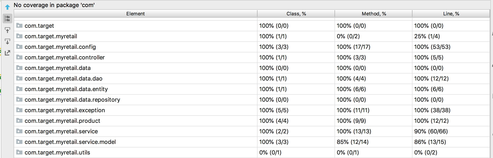

# Retail Product API
### Case Study
myRetail is a rapidly growing company with HQ in Richmond, VA and over 200 stores across the east coast. myRetail wants to make its internal data available to any number of client devices, from myRetail.com to native mobile apps. 
The goal for this project is to create an end-to-end Proof-of-Concept for a products API, which will aggregate product data from multiple sources and return it as JSON to the caller.
## Playbook Instructions
### Pre Requisite
    Java 1.8
    Docker for Cassandra DB
    Gradle 5 or above
    
    Embedded Cassandra for Testing
    
    
 
 You will need to have cassandra running somewhere. If you have docker you can run
 
    docker run -p 9042:9042 cassandra:3.0 
    docker-compose up
 This will bring up a container and expose localhost:9042 for a cassandra connection. By default the application will look for cassandra running here. If you do not have docker you can find installation instructions [here](http://cassandra.apache.org/doc/latest/getting_started/installing.html).
 Alternatively you can bring docker container by running docker-compose up from project home directory
### Code Set up & Deployment
1. Clone the Project : <https://github.com/balasubramanip/myRetailApi>
2. Open windows command prompt and navigate to project location
3. Run ./gradlew bootRun
4. Test API with Swagger :<http://localhost:8883/swagger-ui.html>

## Test Data
    GET id: 13860428
    PUT : {
              "id": 13860428,
              "current_price": {
              "value": 106.99,
              "currency_code": "USD"
              }
           }

## Design, Development, Build, Deploy and Test Approach
To given problem, Spring Boot architecture would be the preferred design for a fast, lightweight and more productive microservices framework. The following technologies have been considered for this approach.
### Technologies
    - Java8, Gradle, Spring Boot 2.1.4, Spring Webflux, Embedded Cassandra DB, Swagger2, 
    
Spring Webflux is used to make non blocking service calls to different services at the same time. 
### Architecture Style

### API Documentation
See Swagger <http://localhost:8883/swagger-ui.html#/>.

### Test Approach
#### Junit Test Result / Code Coverage

### Metrics, Monitor & Health Check the Application
Use Actuator Url <http://localhost:8089/monitor> to get various monitoring links including Healthcheck

#### Endpoints
##### GET /retail/product/{id}

    curl localhost:8883/retail/product/13860428

##### PUT /retail/product/{id}

    curl -X PUT -d @product.json -H "Content-Type: application/json" localhost:8883/retail/product/13860429

##### Sample Product.json
    {
      "id": 13860429,
      "name": "SpongeBob SquarePants: SpongeBob's Frozen Face-off",
      "current_price": {
        "value": 10.99,
        "currency_code": "YEN"
      }
    }

### Testing
Integration test covers most of the scenario. ProductApplicationIntTest uses an embedded cassandra so it could write and read it from cassandra instead of mocking the data. The test then calls service end points against application to confirm the full happy/failure scenarios
